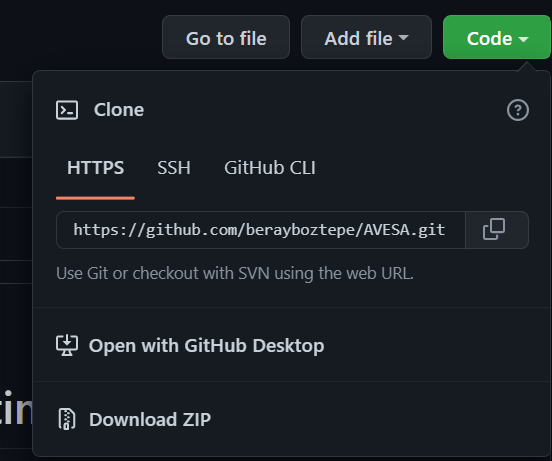

# AVESA (Audio-Visual Event Sentiment Analysis)

- In order to use this GIU first, you need to download this repo using this button.

- You need to run requierements.py file.

- Run project.py The output will give you a local IP adress. Copy that and paste it into the URL section of your browser.

- You can try the model incoming web page on your browser.

- You can also start with the examples that was provided to you

# Enjoy the AVESA
