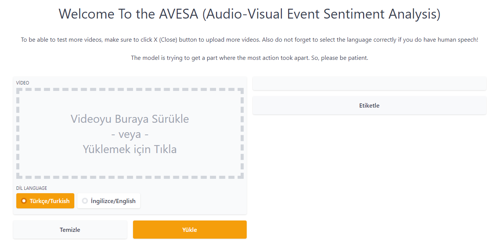

<h1 align="center">AVESA (Audio-Visual Event Sentiment Analysis)</h1>

# Contributors
- <a href="https://github.com/berayboztepe" target="_blank">Beray Boztepe</a>
- <a href="https://scholar.google.com.tr/citations?user=NEhs3ttTIzkC&hl=tr" target="_blank">Bahadır Karasulu</a>
- <a href="https://github.com/bedirhankrkya" target="_blank">Bedirhan Karakaya</a>
- <a href="https://github.com/ismetnl" target="_blank">İsmet Ünlü</a>

# License
- The **MIT License** is used for infrastructure part of AVESA

# Backends (Used Frameworks and Tools)
| Used For | Framework & Tool |
| ------------- | ------------- |
| Keras  | Deep Learning API  |
| Tensorflow-io & Opencv-Python | Getting spectrograms and Data Augmentation techniques such as Multiple Masking, CLAHE etc.  |
| h5py | To Save trained deep learning model |
| Numpy & Pandas & Matplotlib | General Purpose |
| Moviepy & Pydub | Applying some operations into frames and videos |
| NLTK & Zeyrek & Jellyfish | To find Similarity Score |
| NLTK & Spacy | Applying NLP techniques |
| Vosk | Get the speech from the video |
| BERT | Pre-trained models for Sentiment Analysis |
| Transformers | To Apply BERT models into the text for Sentiment Analysis |
| Librosa | Applying Gaussian Noise and some data augmentation techniques  |
| Gradio | To build GUI structure |
| Torch | Used in backend for BERT, Vosk models |

# How to use the AVESA:

- In order to use this GIU, first, you need to download this repo using this link.

https://drive.google.com/drive/folders/1lvji1kKgQv_u-3GwBAYEgt-KuX0ei6yX?usp=sharing

- You need to run requierements.py file. After running the .py file, we recommend you to restart the kernel. Otherwise, you might get some errors about gradio. If there is an error about installing any library, You can use requirements.txt to install all libraries individually.

<p align="center">

</p>

- Run this code section through your ide's console: 
```python
!python -m spacy download en
```

- Run project.py The output will give you a local IP adress. Copy that and paste it into the URL section of your browser. Do not forget to check your current folder inside the editor. **Current folder must be the folder where google drive link downloaded!**

<p align="center">

</p>

<p align="center">

</p>

- You can try the model incoming web page on your browser. Sometimes an error might occur by using not MP4 files. So, we suggest you to use .MP4 files as inputs.

<p align="center">

</p>

- You can also start with the examples that was provided to you.

<p align="center">

</p>


# Errors you might encounter:

- 1) Make sure that your code runs in the same folder where your codes are. To ensure it, you can used this code.
```python
import os
print(os.getcwd())
```
If it is not the same folder, paste this line into the console or terminal of your ide.
```python
cd path\to\your\folder
```

- 2) If you encounter with an error while waiting the output of given video or exit while the model running, in order to run the model again, delete models/video_sum.h5 and delete Frames/name_of_the_video/. Otherwise you migth get these errors:
```diff
- models/video_sum.h5 is running by other process or unable to create a file, the file models/video_sum.h5 already exits: you need to restart to kernel in order to delete this model. After restarting the kernel, you can delete the model and retry to model.
```


- 3) Keep in mind, Frames folder has to be empty. There will be folder in it only while the model is running. In order to run the model again or after the model gives an output, **check if the Frames folder is empty or not.**

- 4) In order to run the model, video_sum.h5 from the models folder should not exists in the folder. In order to run the model, delete this .h5 file first. This file will only be created while the model running and when the output is given, this .h5 file should be deleted. **Check if this file is deleted or not.**

# Some Notes:

**Getting every frame and scoring by action rate for every frame process takes long and it gets longer if the video length gets longer! if there is a long text in the ner generated video for English, getting the speech by a vosk model takes long time. For Turkish, it takes short time but because of the proposed algorithm for Turkish NER, the process takes long time. So, please be patient to see the output while the model running.** 

**You can also follow the process or you can see the reason of error through pycharm or spyder console if you are using one of them.**


# Enjoy the AVESA

**To learn more about the model, you can check the writing about the AVESA here:**
